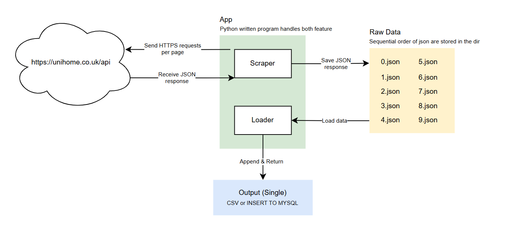

# Data Collection
The section outlines the process of acquiring data, detailing the steps involved in scraping, extracting, and loading the data.

## Data Source
Data was gathered from the API of https://unihomes.co.uk, a reputable platform specialising in student accommodations across the UK. Python language was utilised for the data extraction process, leveraging the "request" library for faciliating HTTP requests to the API endpoints. Additionally, the "json" and "pandas" libraries were employed to parse the response and pre-process the data into a usable CSV format. The dataset encompasses crucial details, such as property addresses, rental price, commute times and distance to and from university.

## Workflow Diagram
The diagram illustrates the sequential steps involved in the data acquisition process.

## Data Dictionary
An overview of fields included in the dataset.

<table>
  <tr>
    <th>Field Name</th>
    <th>Description</th>
  </tr>
  <tr>
    <td>property_id</td>
    <td>A unique identifier for each property.</td>
  </tr>
  <tr>
    <td>lat</td>
    <td>Latitude coordinate of the property's location.</td>
  </tr>
  <tr>
    <td>long</td>
    <td>Longitude coordinate of the property's location.</td>
  </tr>
  <tr>
    <td>price</td>
    <td>Weekly price of the property.</td>
  </tr>
  <tr>
    <td>images</td>
    <td>Number of photographs associated with the property.</td>
  </tr>
  <tr>
    <td>type</td>
    <td>Type of property (e.g., apartment, and house).</td>
  </tr>
  <tr>
    <td>addressShort</td>
    <td>A shortened version of the property's address.</td>
  </tr>
  <tr>
    <td>street</td>
    <td>Street address of the property.</td>
  </tr>
  <tr>
    <td>fname</td>
    <td>First name of the agent.</td>
  </tr>
  <tr>
    <td>sname</td>
    <td>Surname of the agent.</td>
  </tr>
  <tr>
    <td>company</td>
    <td>Company managing the property letting.</td>
  </tr>
  <tr>
    <td>added</td>
    <td>Indicator whether the property is available in the market</td>
  </tr>
  <tr>
    <td>distance_uol</td>
    <td>Distance of the property from a UoL (University of Leicester).</td>
  </tr>
  <tr>
    <td>uol_minute_by_walk</td>
    <td>Time taken to walk from the property to UoL (University of Leicester)</td>
  </tr>
</table>

## Restrictions
Several limitations were encountered during the data collection phase due to the inherent constraints of the API. 

The API imposed restrictions on the volume of data accessible per request and enforced rate limits to prevent excessive querying. To address these issues, a strategy of paginated requests was implemented, ensuring comprehensive data retrieval while adhering to the API's constraints. 

Additionally, requests were scheduled to comply with rate limits, thereby preventing interruptions in data collection. Error handling and retry mechanisms were also incorporated to manage any temporary API issues.