# Data Wrangling
This section outlines all the data transformation processes done to dataset.

## Pre-Modification Measures
Before any data transformation, measures were taken to ensure data integrity.

**Creation of Backup Sheet** 
A backup of the original dataset was created.
The backup sheet was protected to prevent modifications and hidden from the working environment to avoid accidental changes.

**Data Integrity Checks** 
Prior to any modification, thorough checks were conducted to ensure the integrity and consistency of the dataset.

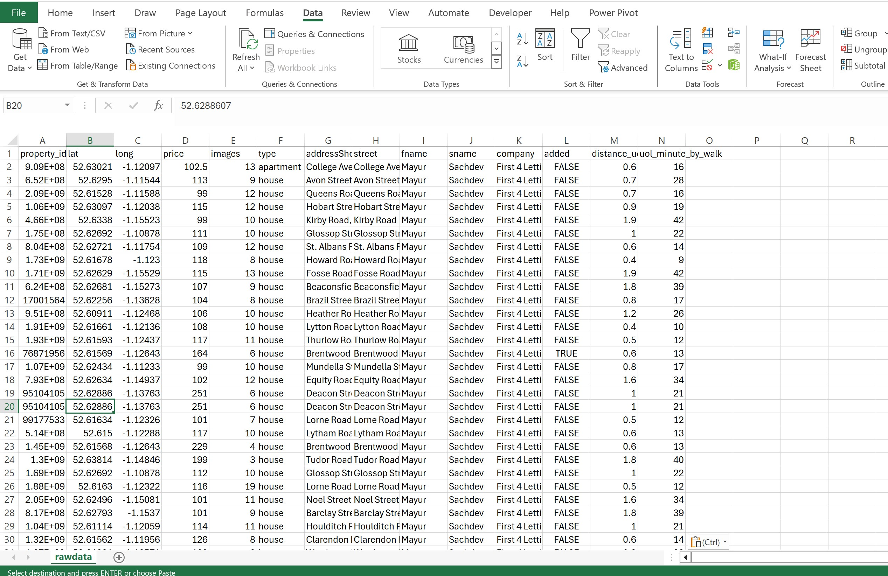
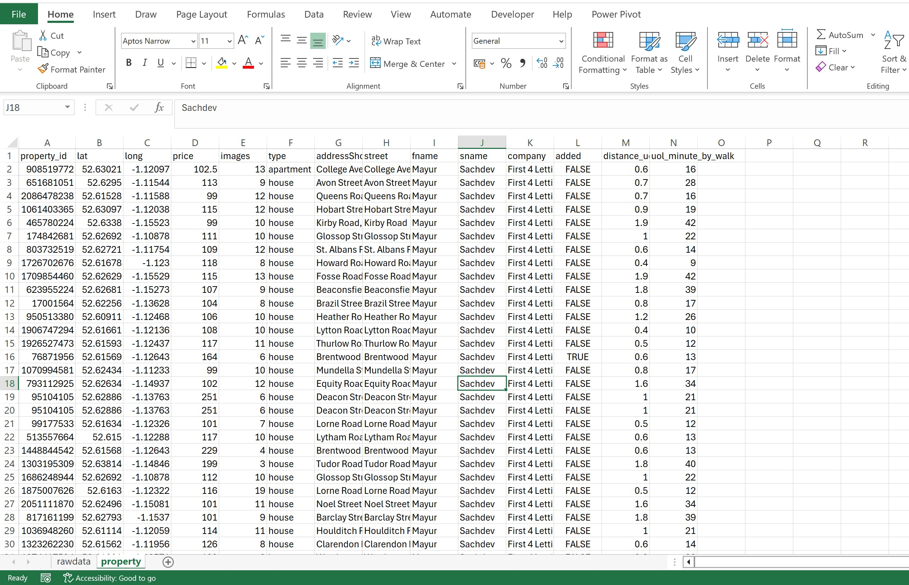

## Cleaning Steps Applied

**Convert Data to Table** 
The data was converted into a table format to enhance data handling and analysis capabilities.

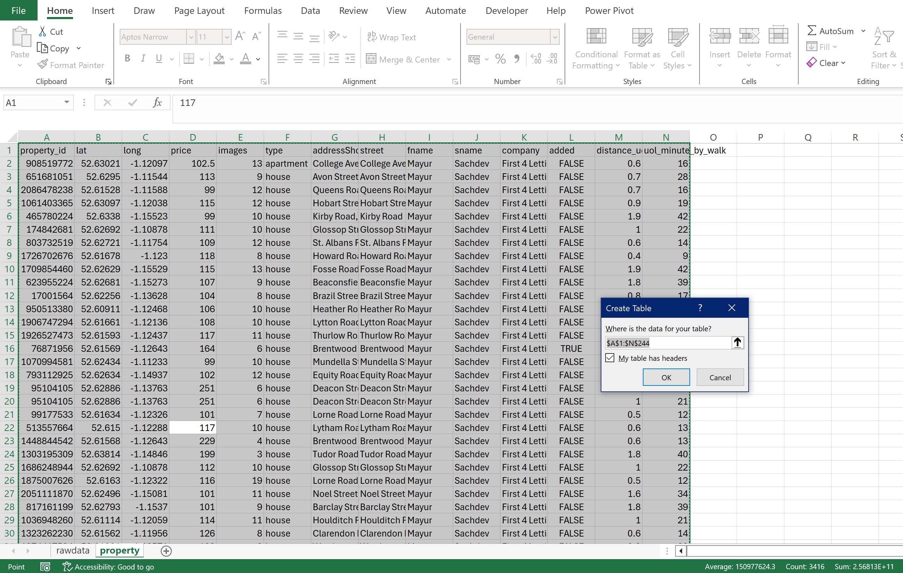

**Duplicate Record Removal** 
Identified and removed 13 duplicate records based on multiple criteria: property_id, latitude, longitude, address, type, and price. Remain 230 unique records.

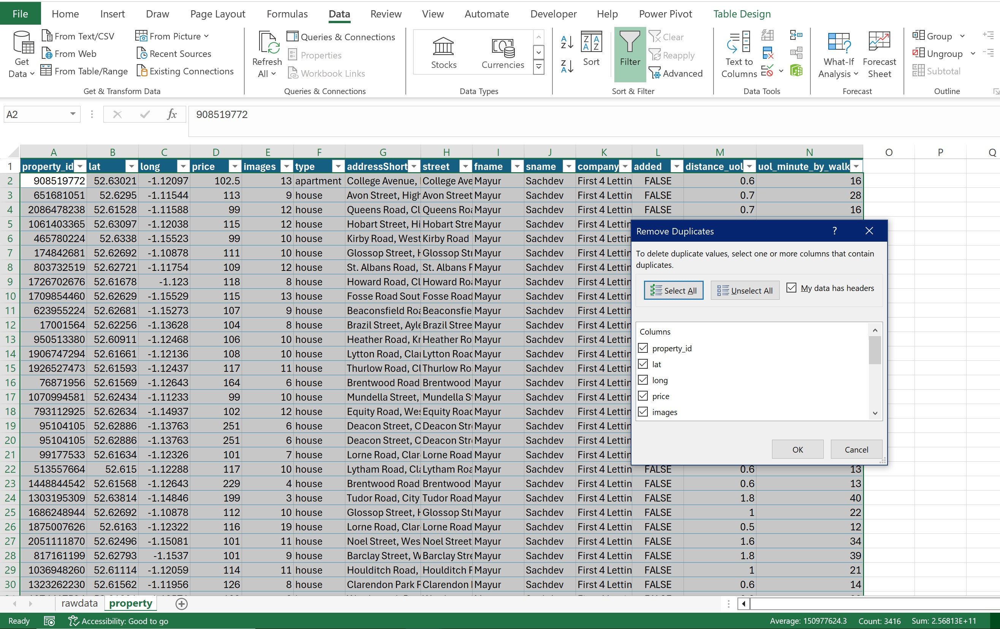
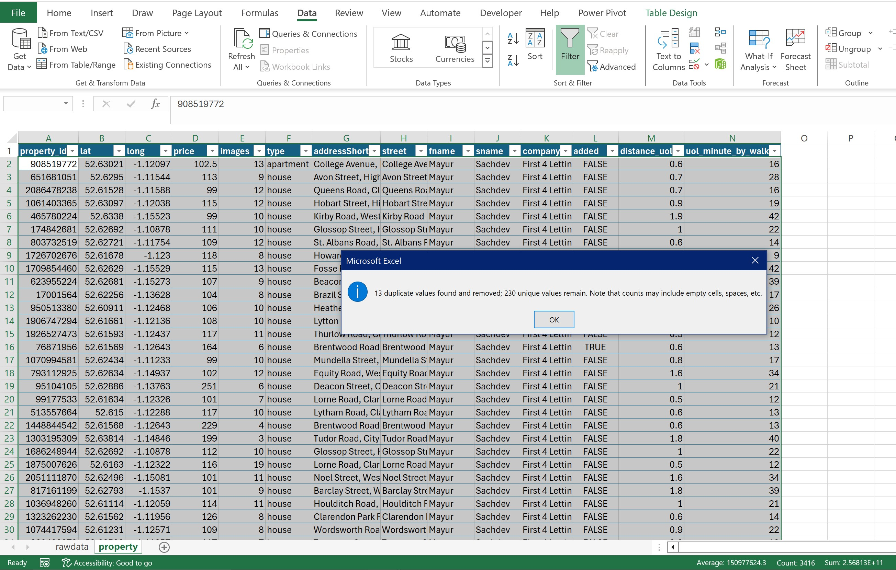

**Removal of Irrelevant & Duplicated Columns** 
Removed repeated and irrelevant columns (e.g., address, images, status, and added) to streamline the dataset.

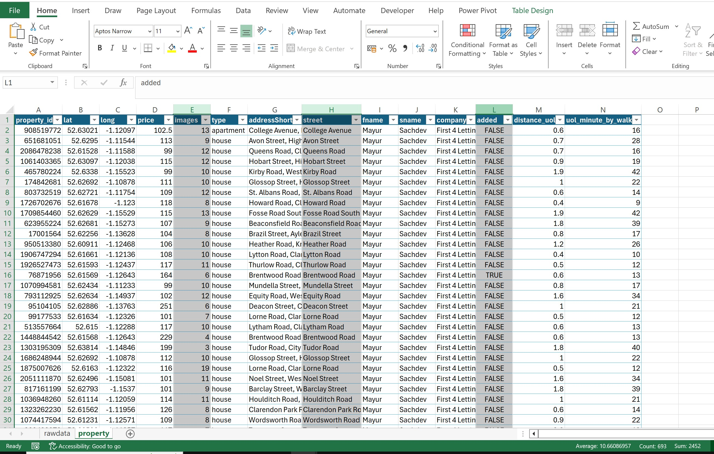

**Handling Zeros and Null Values** 
Applied conditional formatting to highlight records with values below zero, such as distance_to_uol, time_by_walk, and price, as well as to identify empty records. 6 records were removed and remain 224.

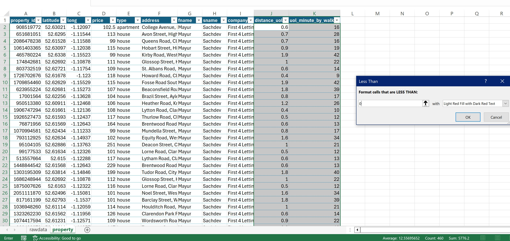

**Concatenation of Column Values** 
Concatenated the fname and sname columns using the CONCAT and TRIM functions to create a full_name column for the agent.

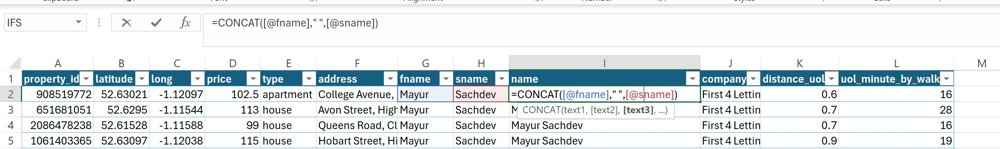

**Text to Column** 
Split the address field, which contained both the address line and the area within Leicester, into two separate columns using a comma delimiter.

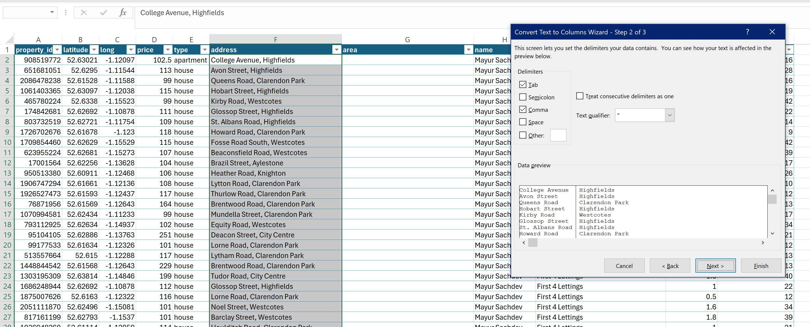

**Standardisation of Similar Addresses** 
Standardised minor inconsistencies where the same address appeared differently after splitting the column.

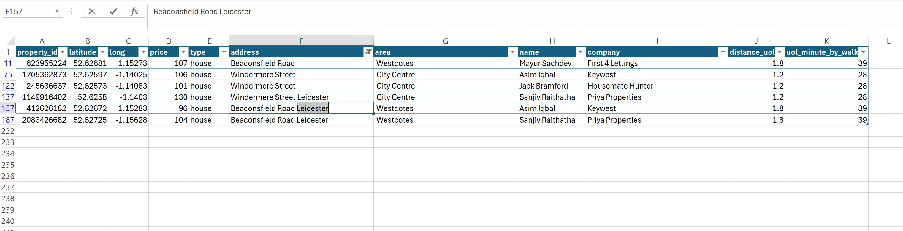

**Data Formatting** 
Formatted the data appropriately for currency, distance, and time to ensure consistency and accuracy in reporting and analysis.

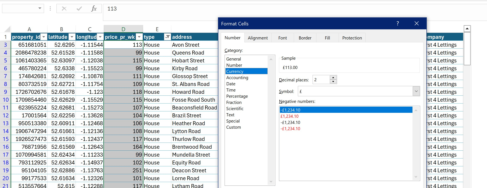

**Renaming Column Names** 
Renamed several columns to more appropriate titles (e.g., member, trade, property, type) for clarity.

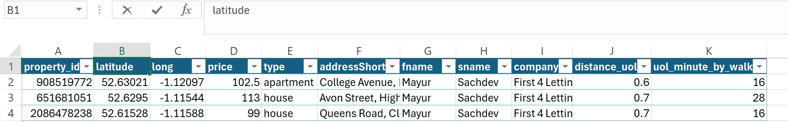