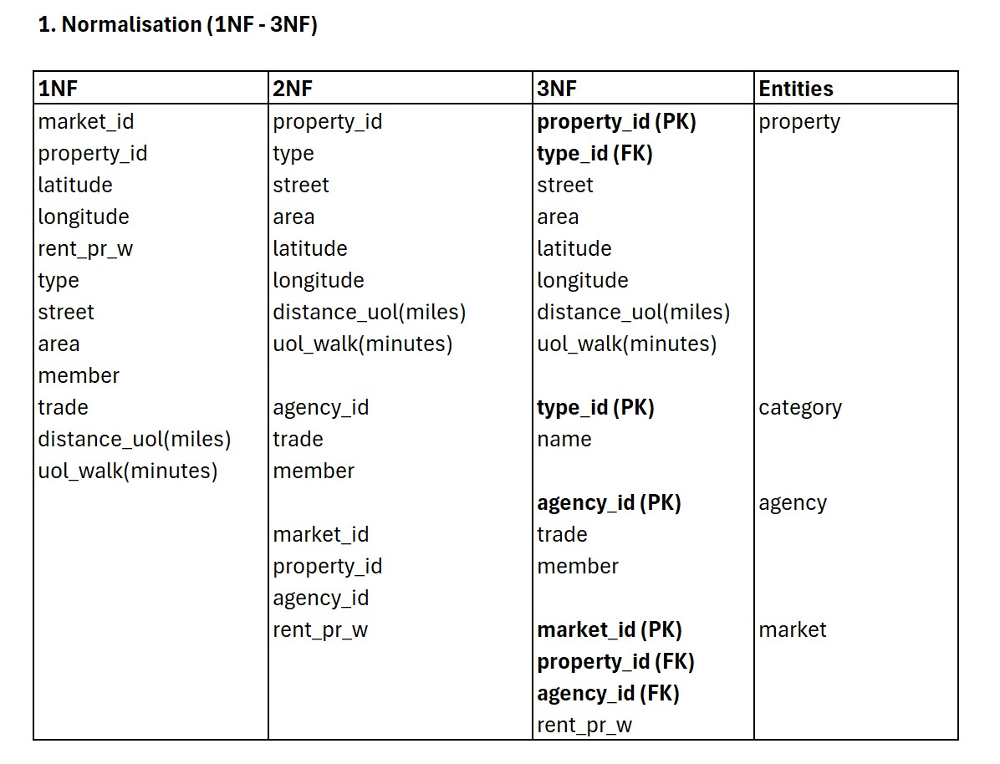
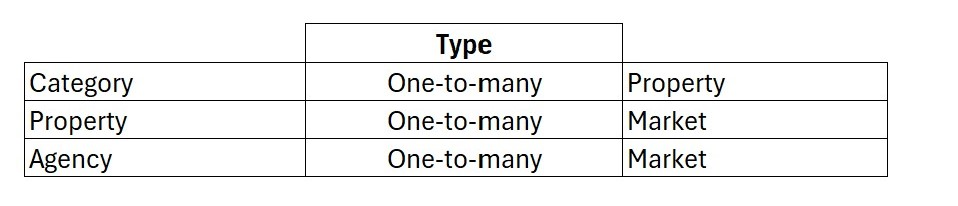
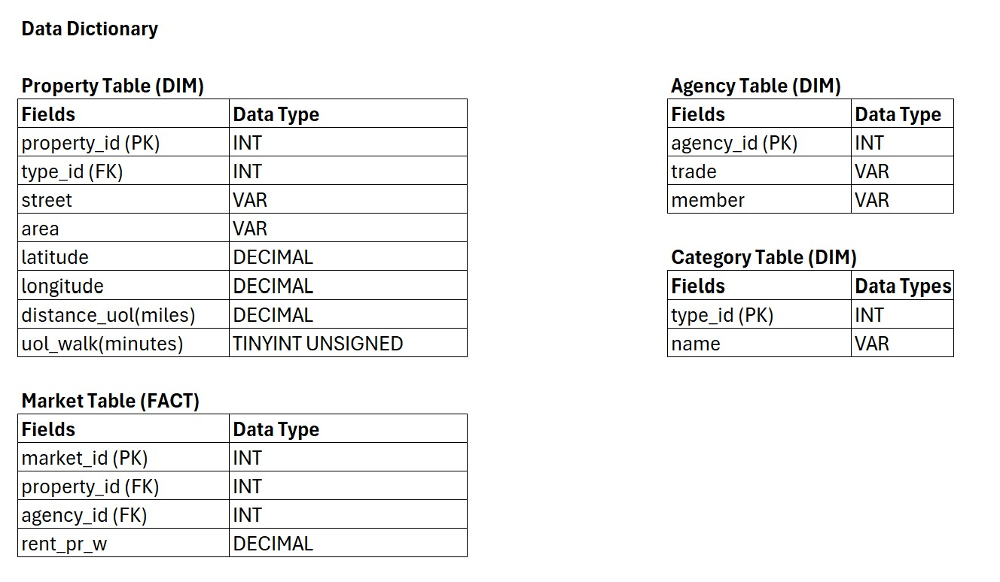
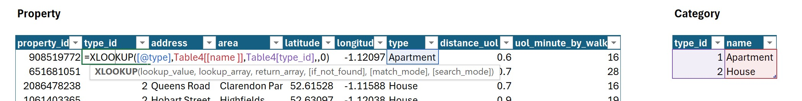
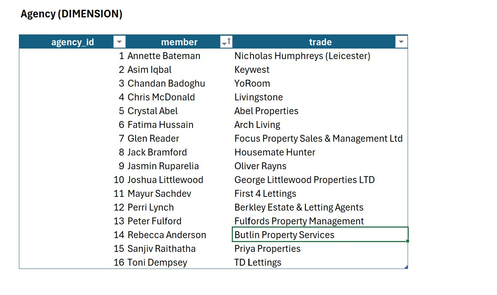
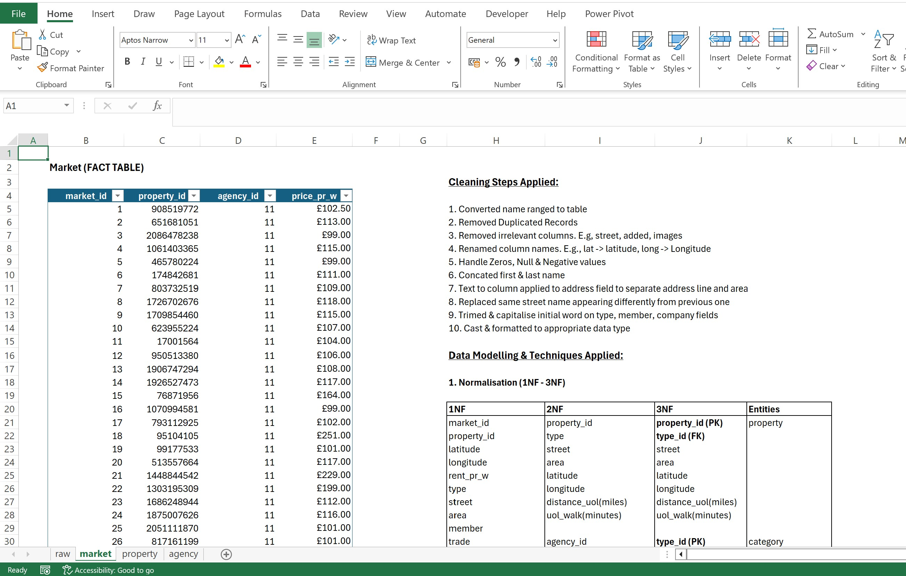
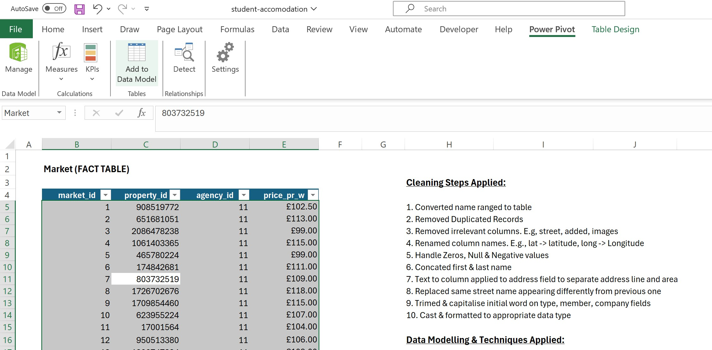
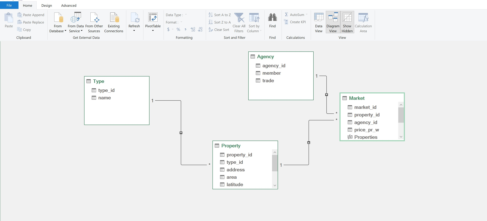
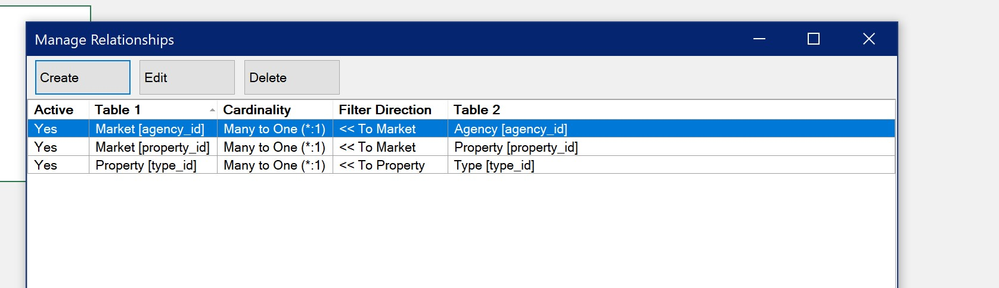
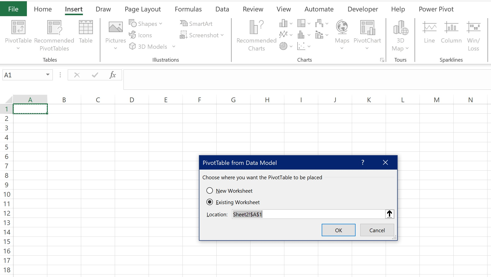

# Data Modelling
This section outlines the theoretical and practical implementation of data modelling techniques to the dataset.
## Theoretical
### Normalisation
Normalisation is a process used to organise data to reduce redundancy and improve data integrity.

### Relationship
Established relationships between entities using common keys, such as primary and foreign keys.

### Data Dictionary
Below is the metadata and structure of the tables.

## Practical Implementation
I created multiple tailored versions of the cleaned table to suit specific purposes. In each duplicate table, I removed columns that were unnecessary or redundant for its intended use. For example, in the property table, I excluded columns like price and member, which were irrelevant.

To combine and assign foreign keys with primary keys, the XLOOKUP function was used according to the data diagram. The same process was applied to other tables, such as agency, market, and category.

I ensured that each table contains unique records to maintain proper relationships. For instance, the agency table initially had duplicate records of members and trade names, which was unacceptable. Therefore, I used the duplicate removal feature to eliminate matching records based on member and trade name.

Once all the dimension were set up, I shifted focus to creating and organising the factual table named "market." I inserted a new index column using the fill-in series feature, ensuring the property_id was retained. Additionally, I used the XLOOKUP function to retrieve index values for property, and agency.

Added all the tables to power-pivot (modelling tool)

Once the model and relationships were set up, the data was ready to be loaded into a pivot table for summarisation and analysis.

