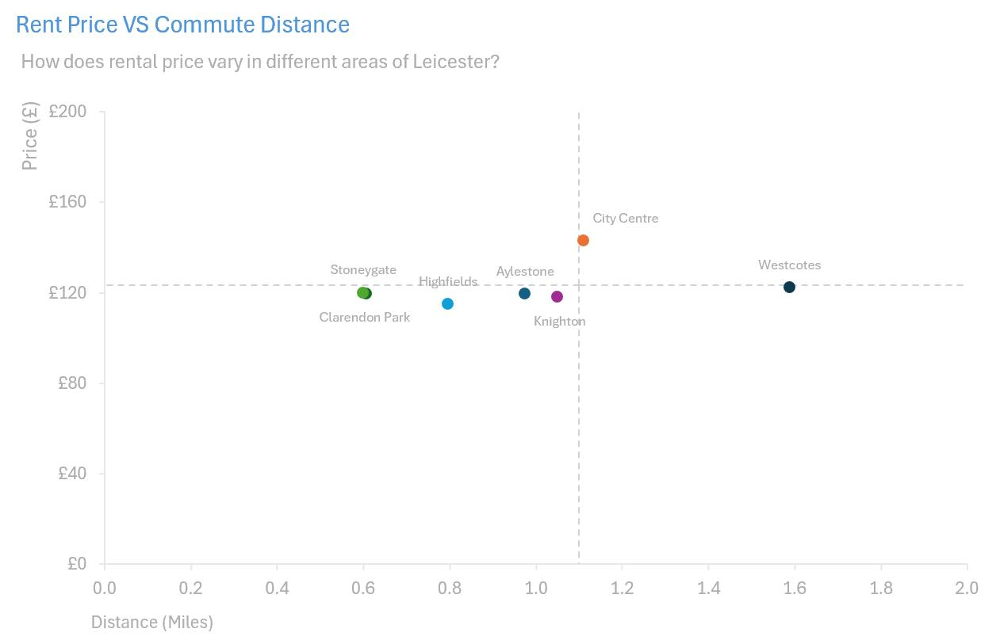

## Analysis I: Property Summary

How many leased properties are available in Leicester?

What types of properties are available for rent in Leicester?

Which areas within Leicester exhibits a notable concentration of accomodation?

Who are the top five leading real estate agencies managing rental properties in Leicester?

What is the average travel distance, expressed in miles and corresponding commute time to UoL (University of Leicester)?

Which areas offer close proximity to the University of Leicester?

## Analysis II: Rent Price
What is the average rental price for properties?

How does weekly rental price vary between house and apartments?

How does rental pricing vary by area within Leicester?

